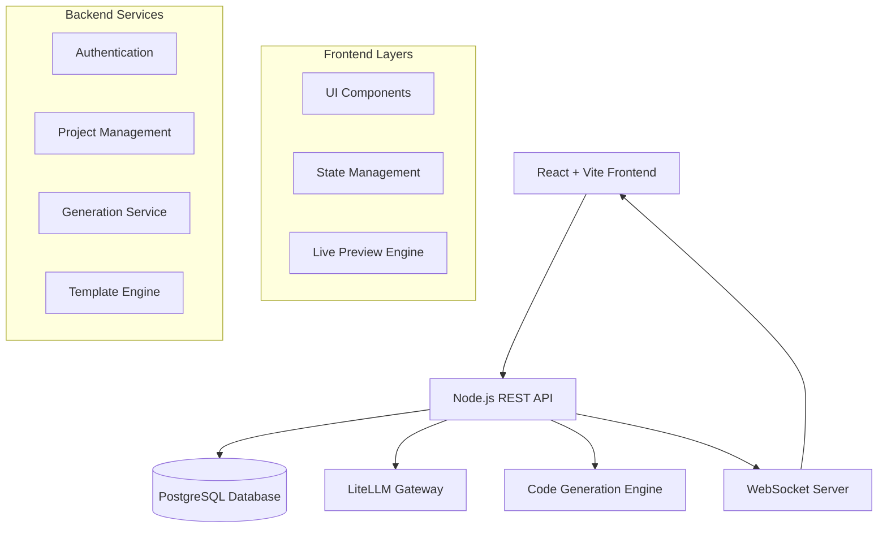

# Design Document

## Overview

The AI-Powered Prototype Generator is a full-stack web application that transforms natural language descriptions into functional HTML5/JavaScript or React prototypes. The system follows a three-phase workflow: detailed planning, transparent execution with real-time feedback, and comprehensive output documentation. Built with production-grade architecture and open source principles in mind.

## UI Wireframes

### Main Application Layout
```
┌─────────────────────────────────────────────────────────────┐
│ AI Prototype Generator                    [Model: DeepSeek] │
├─────────────────────────────────────────────────────────────┤
│                                                             │
│  ┌─────────────────────┐  ┌─────────────────────────────────┐ │
│  │                     │  │                                 │ │
│  │   INPUT PANEL       │  │        PREVIEW PANEL            │ │
│  │                     │  │                                 │ │
│  │ ┌─────────────────┐ │  │  ┌─────────────────────────────┐ │ │
│  │ │ Describe your   │ │  │  │                             │ │ │
│  │ │ prototype...    │ │  │  │     Live Preview            │ │ │
│  │ │                 │ │  │  │                             │ │ │
│  │ │                 │ │  │  │                             │ │ │
│  │ └─────────────────┘ │  │  └─────────────────────────────┘ │ │
│  │                     │  │                                 │ │
│  │ Output: [HTML+JS ▼] │  │  [Desktop] [Tablet] [Mobile]    │ │
│  │ Style: [Tailwind ▼] │  │                                 │ │
│  │                     │  │                                 │ │
│  │    [Generate Plan]  │  │                                 │ │
│  │                     │  │                                 │ │
│  └─────────────────────┘  └─────────────────────────────────┘ │
│                                                             │
├─────────────────────────────────────────────────────────────┤
│                    WORKFLOW PANEL                           │
│  [1. Planning] → [2. Generation] → [3. Documentation]      │
└─────────────────────────────────────────────────────────────┘
```

### Planning Phase View
```
┌─────────────────────────────────────────────────────────────┐
│ Generation Plan                                             │
├─────────────────────────────────────────────────────────────┤
│                                                             │
│  📋 COMPONENTS TO BUILD                                     │
│  ┌─────────────────────────────────────────────────────────┐ │
│  │ ✓ Header Navigation (responsive)                        │ │
│  │ ✓ Hero Section with CTA                                 │ │
│  │ ✓ Feature Cards Grid                                    │ │
│  │ ✓ Contact Form with validation                          │ │
│  │ ✓ Footer with social links                              │ │
│  └─────────────────────────────────────────────────────────┘ │
│                                                             │
│  🏗️ ARCHITECTURE                                            │
│  ┌─────────────────────────────────────────────────────────┐ │
│  │ • Single HTML file with embedded CSS/JS                 │ │
│  │ • TailwindCSS via CDN for styling                       │ │
│  │ • Vanilla JavaScript for interactions                   │ │
│  │ • Mobile-first responsive design                        │ │
│  └─────────────────────────────────────────────────────────┘ │
│                                                             │
│  ⏱️ ESTIMATED TIME: 3-5 minutes                             │
│                                                             │
│              [Modify Plan]    [Approve & Generate]         │
└─────────────────────────────────────────────────────────────┘
```

### Generation Phase View
```
┌─────────────────────────────────────────────────────────────┐
│ Generating Your Prototype...                    [Progress] │
├─────────────────────────────────────────────────────────────┤
│                                                             │
│  🔄 CURRENT STEP                                            │
│  ┌─────────────────────────────────────────────────────────┐ │
│  │ Creating responsive navigation component...              │ │
│  │                                                         │ │
│  │ I'm building a mobile-first navigation with a hamburger │ │
│  │ menu for smaller screens. Using Flexbox for layout and  │ │
│  │ CSS transitions for smooth animations.                  │ │
│  └─────────────────────────────────────────────────────────┘ │
│                                                             │
│  ✅ COMPLETED STEPS                                         │
│  ┌─────────────────────────────────────────────────────────┐ │
│  │ ✓ Project structure setup                               │ │
│  │ ✓ Base HTML template created                            │ │
│  │ ✓ TailwindCSS integration                               │ │
│  │ ✓ Header navigation → Currently working                 │ │
│  │ ⏳ Hero section                                          │ │
│  │ ⏳ Feature cards                                         │ │
│  │ ⏳ Contact form                                          │ │
│  └─────────────────────────────────────────────────────────┘ │
│                                                             │
│  Progress: ████████░░░░ 60% | ETA: 2 minutes               │
└─────────────────────────────────────────────────────────────┘
```

### Code Editor & Documentation View
```
┌─────────────────────────────────────────────────────────────┐
│ Generated Code & Documentation                              │
├─────────────────────────────────────────────────────────────┤
│                                                             │
│ ┌─────────────────────┐  ┌─────────────────────────────────┐ │
│ │   CODE SECTIONS     │  │        DOCUMENTATION            │ │
│ │                     │  │                                 │ │
│ │ 📄 index.html       │  │  📋 Component Overview          │ │
│ │ 🎨 styles.css       │  │                                 │ │
│ │ ⚡ script.js        │  │  🏗️ Header Navigation           │ │
│ │                     │  │  • Responsive design            │ │
│ │ ┌─────────────────┐ │  │  • Mobile hamburger menu        │ │
│ │ │ <nav class=     │ │  │  • Smooth transitions           │ │
│ │ │   "flex items-  │ │  │                                 │ │
│ │ │    center       │ │  │  To customize:                  │ │
│ │ │    justify-     │ │  │  1. Change colors in line 23    │ │
│ │ │    between      │ │  │  2. Modify logo in line 15      │ │
│ │ │    p-4 bg-      │ │  │  3. Add menu items in line 45   │ │
│ │ │    white">      │ │  │                                 │ │
│ │ │   <div class=   │ │  │  🎯 Hero Section                │ │
│ │ │     "text-xl    │ │  │  • Call-to-action button        │ │
│ │ │      font-bold  │ │  │  • Background gradient          │ │
│ │ └─────────────────┘ │  │  • Centered content             │ │
│ │                     │  │                                 │ │
│ └─────────────────────┘  └─────────────────────────────────┘ │
│                                                             │
│              [Copy Code]    [Download Files]    [Export]   │
└─────────────────────────────────────────────────────────────┘
```

### Model Configuration Panel
```
┌─────────────────────────────────────────────────────────────┐
│ LLM Configuration                                    [⚙️]   │
├─────────────────────────────────────────────────────────────┤
│                                                             │
│  Model: [DeepSeek Chat        ▼]                           │
│                                                             │
│  Available Models:                                          │
│  • deepseek-chat (Recommended)                              │
│  • gpt-4-turbo                                              │
│  • claude-3-sonnet                                          │
│  • gpt-3.5-turbo                                            │
│                                                             │
│  Gateway URL: [https://api.litellm.ai/v1]                  │
│                                                             │
│  Temperature: [0.7] ████████░░                              │
│  Max Tokens:  [4000]                                        │
│                                                             │
│              [Test Connection]    [Save Settings]          │
└─────────────────────────────────────────────────────────────┘
```

## Architecture

### High-Level Architecture



### Technology Stack

**Frontend (Modular Architecture):**
- React 18 with TypeScript (max 300 lines per file)
- Vite for build tooling and dev server
- TailwindCSS for styling
- Zustand for state management (split into multiple stores)
- React Query for server state
- Monaco Editor for code editing
- WebSocket client for real-time updates
- Modular component structure with clear separation

**Backend (Modular Services):**
- Node.js with Express.js (max 300 lines per file)
- TypeScript for type safety
- PostgreSQL with Prisma ORM
- WebSocket server (ws library)
- LiteLLM integration for AI model flexibility
- diff-patch-apply for surgical edits
- Hardcoded user ID for MVP (auth later)
- Service-oriented architecture with clear boundaries

**Infrastructure:**
- Docker containers for deployment
- Environment-based configuration
- Structured logging
- Health check endpoints

## Components and Interfaces

### Frontend Components

#### Core UI Components
```typescript
// Main application shell
interface AppShellProps {
  user?: User;
  onLogout: () => void;
}

// Project creation and management
interface ProjectWizardProps {
  onProjectCreate: (project: ProjectConfig) => void;
  templates: Template[];
}

// Three-phase generation workflow
interface GenerationWorkflowProps {
  projectId: string;
  onPhaseComplete: (phase: WorkflowPhase) => void;
}
```

#### Planning Phase Component
```typescript
interface PlanningPhaseProps {
  prompt: string;
  preferences: GenerationPreferences;
  onPlanApprove: (plan: GenerationPlan) => void;
  onPlanModify: (modifications: PlanModification[]) => void;
}

interface GenerationPlan {
  id: string;
  components: ComponentPlan[];
  architecture: ArchitecturePlan;
  timeline: TimelineEstimate;
  dependencies: Dependency[];
}
```

#### Execution Phase Component
```typescript
interface ExecutionPhaseProps {
  plan: GenerationPlan;
  onProgress: (progress: GenerationProgress) => void;
  onComplete: (result: GenerationResult) => void;
}

interface GenerationProgress {
  currentStep: string;
  completedSteps: string[];
  explanation: string;
  estimatedTimeRemaining: number;
}
```

#### Preview and Documentation Component
```typescript
interface PreviewPanelProps {
  generatedCode: GeneratedCode;
  previewMode: 'desktop' | 'tablet' | 'mobile';
  onCodeEdit: (section: string, newCode: string) => void;
}

interface DocumentationPanelProps {
  documentation: ComponentDocumentation[];
  generatedCode: GeneratedCode;
}
```

### Backend API Interfaces

#### REST API Endpoints
```typescript
// Streaming generation workflow
POST   /api/generate/stream       // Start streaming generation (WebSocket)
POST   /api/generate/plan         // Generate plan from prompt
GET    /api/generate/status/:id   // Get generation status

// Fast surgical editing
POST   /api/edit/element          // Edit specific element (fast patch)
POST   /api/edit/section          // Edit code section (fast patch)
POST   /api/edit/apply-patch      // Apply diff patch to element
GET    /api/edit/preview/:id      // Get updated preview

// Code organization and export
GET    /api/projects/:id/sections // Get organized code sections
POST   /api/projects/:id/export   // Export organized files
GET    /api/projects/:id/html     // Get final organized HTML

// LiteLLM integration
POST   /api/llm/stream            // Streaming LLM communication
GET    /api/llm/models            // Available models
PUT    /api/llm/config            // Update model configuration

// Simple project management
GET    /api/projects              // List projects (hardcoded user)
POST   /api/projects              // Create project
GET    /api/projects/:id          // Get project details
```

#### Server-Side Patching System
```typescript
interface PatchingService {
  // Fast element editing using diff-patch-apply
  applyElementPatch(elementId: string, oldContent: string, newContent: string): PatchResult;
  
  // Section-based patching for organized code
  applySectionPatch(sectionName: string, patches: DiffPatch[]): SectionPatchResult;
  
  // Maintain code organization during edits
  reorganizeHTML(htmlContent: string): OrganizedHTML;
}

interface OrganizedHTML {
  sections: {
    header: HTMLSection;
    navigation: HTMLSection;
    main: HTMLSection;
    footer: HTMLSection;
    styles: CSSSection;
    scripts: JSSection;
  };
  elementMap: Map<string, ElementLocation>;
}

interface ElementLocation {
  sectionName: string;
  startLine: number;
  endLine: number;
  elementId: string;
  elementType: string;
}
```

#### LiteLLM Integration
```typescript
interface LLMConfig {
  gatewayUrl: string;
  model: string; // 'deepseek-chat', 'gpt-4', 'claude-3', etc.
  apiKey?: string;
  temperature: number;
  maxTokens: number;
}

interface LLMService {
  generatePlan(prompt: string, preferences: GenerationPreferences): Promise<GenerationPlan>;
  generateCode(plan: GenerationPlan, section: string): Promise<CodeSection>;
  explainGeneration(context: GenerationContext): Promise<string>;
}
```

#### WebSocket Events (Streaming Focus)
```typescript
interface WebSocketEvents {
  // Streaming generation
  'generation:stream': StreamingUpdate;
  'generation:element': ElementGenerated;
  'generation:section': SectionComplete;
  'generation:complete': GenerationResult;
  'generation:error': GenerationError;
  
  // Real-time editing
  'edit:patch': PatchUpdate;
  'edit:complete': EditResult;
  'preview:update': PreviewRefresh;
}

interface StreamingUpdate {
  type: 'planning' | 'generating' | 'documenting';
  content: string;
  elementId?: string;
  sectionName?: string;
  isComplete: boolean;
}

interface ElementGenerated {
  elementId: string;
  elementType: 'component' | 'section' | 'style';
  htmlContent: string;
  cssContent?: string;
  jsContent?: string;
  documentation: string;
  position: ElementPosition;
}

interface PatchUpdate {
  elementId: string;
  patches: DiffPatch[];
  newContent: string;
  affectedSections: string[];
}
```

## Data Models

### Database Schema

```sql
-- Users and authentication
CREATE TABLE users (
  id UUID PRIMARY KEY DEFAULT gen_random_uuid(),
  email VARCHAR(255) UNIQUE NOT NULL,
  name VARCHAR(255) NOT NULL,
  avatar_url TEXT,
  preferences JSONB DEFAULT '{}',
  created_at TIMESTAMP DEFAULT NOW(),
  updated_at TIMESTAMP DEFAULT NOW()
);

-- Projects
CREATE TABLE projects (
  id UUID PRIMARY KEY DEFAULT gen_random_uuid(),
  user_id UUID REFERENCES users(id) ON DELETE CASCADE,
  name VARCHAR(255) NOT NULL,
  description TEXT,
  prompt TEXT NOT NULL,
  preferences JSONB DEFAULT '{}',
  status VARCHAR(50) DEFAULT 'draft',
  created_at TIMESTAMP DEFAULT NOW(),
  updated_at TIMESTAMP DEFAULT NOW()
);

-- Generation plans
CREATE TABLE generation_plans (
  id UUID PRIMARY KEY DEFAULT gen_random_uuid(),
  project_id UUID REFERENCES projects(id) ON DELETE CASCADE,
  plan_data JSONB NOT NULL,
  approved BOOLEAN DEFAULT FALSE,
  version INTEGER DEFAULT 1,
  created_at TIMESTAMP DEFAULT NOW()
);

-- Generated code and sections
CREATE TABLE code_sections (
  id UUID PRIMARY KEY DEFAULT gen_random_uuid(),
  project_id UUID REFERENCES projects(id) ON DELETE CASCADE,
  section_name VARCHAR(255) NOT NULL,
  section_type VARCHAR(100) NOT NULL,
  code_content TEXT NOT NULL,
  documentation TEXT,
  order_index INTEGER DEFAULT 0,
  created_at TIMESTAMP DEFAULT NOW(),
  updated_at TIMESTAMP DEFAULT NOW()
);

-- Generation history and logs
CREATE TABLE generation_logs (
  id UUID PRIMARY KEY DEFAULT gen_random_uuid(),
  project_id UUID REFERENCES projects(id) ON DELETE CASCADE,
  phase VARCHAR(50) NOT NULL,
  step_name VARCHAR(255) NOT NULL,
  explanation TEXT,
  status VARCHAR(50) NOT NULL,
  metadata JSONB DEFAULT '{}',
  created_at TIMESTAMP DEFAULT NOW()
);
```

### TypeScript Data Models

```typescript
// Core domain models
interface User {
  id: string;
  email: string;
  name: string;
  avatarUrl?: string;
  preferences: UserPreferences;
  createdAt: Date;
  updatedAt: Date;
}

interface Project {
  id: string;
  userId: string;
  name: string;
  description?: string;
  prompt: string;
  preferences: GenerationPreferences;
  status: ProjectStatus;
  plan?: GenerationPlan;
  codeSections: CodeSection[];
  createdAt: Date;
  updatedAt: Date;
}

interface GenerationPreferences {
  outputType: 'html-js' | 'react';
  framework: 'vanilla' | 'react' | 'vue';
  styling: 'tailwind' | 'css' | 'styled-components';
  responsive: boolean;
  accessibility: boolean;
}

interface CodeSection {
  id: string;
  projectId: string;
  sectionName: string;
  sectionType: 'component' | 'style' | 'script' | 'html';
  codeContent: string;
  documentation?: string;
  orderIndex: number;
}
```

## Error Handling

### Frontend Error Boundaries
```typescript
interface ErrorBoundaryState {
  hasError: boolean;
  error?: Error;
  errorInfo?: ErrorInfo;
}

class GenerationErrorBoundary extends Component<Props, ErrorBoundaryState> {
  // Handle generation-specific errors
  // Provide recovery options
  // Log errors for debugging
}
```

### Backend Error Handling
```typescript
interface APIError {
  code: string;
  message: string;
  details?: any;
  timestamp: Date;
}

// Centralized error handling middleware
const errorHandler = (err: Error, req: Request, res: Response, next: NextFunction) => {
  // Log error with context
  // Return appropriate HTTP status
  // Provide helpful error messages
  // Handle different error types (validation, auth, generation, etc.)
};
```

### Generation Error Recovery
- Automatic retry mechanisms for transient failures
- Partial generation recovery (save progress)
- Fallback to simpler generation approaches
- Clear error messages with suggested fixes

## Testing Strategy

### Frontend Testing
```typescript
// Component testing with React Testing Library
describe('GenerationWorkflow', () => {
  it('should progress through all three phases', async () => {
    // Test planning phase
    // Test execution phase  
    // Test documentation phase
  });
});

// Integration tests for WebSocket communication
describe('Real-time Updates', () => {
  it('should receive generation progress updates', async () => {
    // Mock WebSocket server
    // Test progress updates
    // Verify UI updates
  });
});
```

### Backend Testing
```typescript
// API endpoint testing
describe('Generation API', () => {
  it('should create generation plan from prompt', async () => {
    // Test plan generation
    // Verify plan structure
    // Test error cases
  });
});

// Database integration tests
describe('Project Repository', () => {
  it('should persist project with code sections', async () => {
    // Test CRUD operations
    // Test relationships
    // Test data integrity
  });
});
```

### End-to-End Testing
- Complete generation workflow testing
- Cross-browser compatibility
- Performance testing under load
- Accessibility compliance testing

## Security Considerations

### MVP Security (Simplified)
- Hardcoded user ID for development
- Basic CORS configuration
- Input sanitization
- Rate limiting for LLM calls

### Data Protection
- Input sanitization and validation
- SQL injection prevention (Prisma ORM)
- XSS protection
- Secure code generation (sandboxed execution)

### Infrastructure Security
- Environment variable management
- Database connection security
- HTTPS enforcement
- Security headers middleware

## Performance Optimization

### Frontend Performance
- Code splitting and lazy loading
- Virtual scrolling for large code sections
- Debounced preview updates
- Optimistic UI updates

### Backend Performance
- Database query optimization
- Caching strategies (Redis for session/plan caching)
- Background job processing for generation
- Connection pooling

### Generation Performance
- Streaming responses for real-time updates
- Parallel component generation
- Template caching
- Progressive code delivery